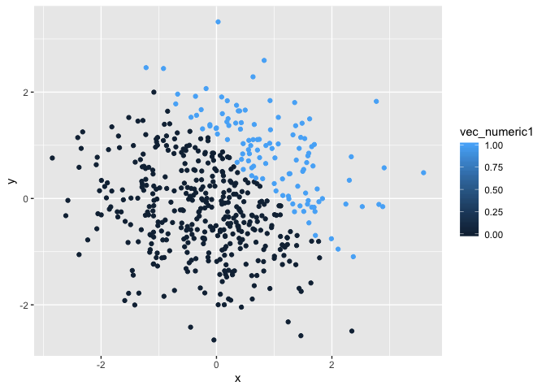
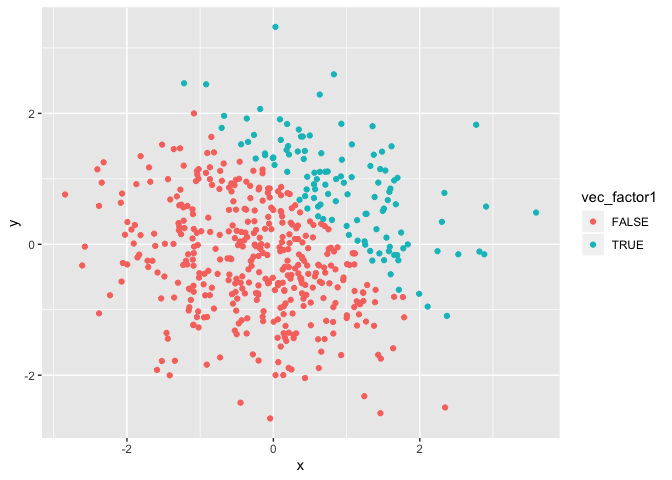

p8105\_hw1\_yy2912.Rmd
================

\#\#problem 1 create a dataframe with different variable types\#\#

``` r
q1dataframe = tibble(
  vec_numeric = rnorm(8),
  vec_logical = vec_numeric > 0,
  vec_char = c("This", "dataset", "comes", "from", "groups", "of", "cancer", "patients"),
  vec_factor = factor(c("young", "young", "young", "middleage","middleage","middleage", "old", "old"))
)

class(pull(q1dataframe, vec_numeric))
```

    ## [1] "numeric"

``` r
class(pull(q1dataframe, vec_logical))
```

    ## [1] "logical"

``` r
class(pull(q1dataframe, vec_char))
```

    ## [1] "character"

``` r
class(pull(q1dataframe, vec_factor))
```

    ## [1] "factor"

``` r
mean_numeric = mean(pull(q1dataframe, vec_numeric))
mean_logical = mean(pull(q1dataframe, vec_logical))
mean_char = mean(pull(q1dataframe, vec_char))
```

    ## Warning in mean.default(pull(q1dataframe, vec_char)): argument is not
    ## numeric or logical: returning NA

``` r
mean_factor = mean(pull(q1dataframe, vec_factor))
```

    ## Warning in mean.default(pull(q1dataframe, vec_factor)): argument is not
    ## numeric or logical: returning NA

\#\#when take mean of the variables, character and factor variables do
not work; numeric and logical variable work \#\#

``` r
set.seed(13)
x = as.numeric(q1dataframe$vec_logical)
y = as.numeric(q1dataframe$vec_char)
```

    ## Warning: NAs introduced by coercion

``` r
z = as.numeric(q1dataframe$vec_factor)

x*q1dataframe$vec_numeric
```

    ## [1] 0.0000000 0.6182175 0.0000000 0.0000000 0.0000000 0.8100688 0.0000000
    ## [8] 1.9576464

``` r
y*q1dataframe$vec_numeric
```

    ## [1] NA NA NA NA NA NA NA NA

``` r
z*q1dataframe$vec_numeric
```

    ## [1] -3.48714543  1.85465263 -0.07595412 -1.13533413 -1.52492961  0.81006880
    ## [7] -0.83806363  3.91529271

logical and factor variables can be converted to numeric variables but
character variables cannot. This can explain why character variable
cannot take the mean but cannot explain why factor variables cannot take
the mean.

\#\#question 2 creates a dataframe

``` r
set.seed(13)

q2dataframe = tibble(
  x = rnorm(500, mean=0, sd=1),
  y = rnorm(500, mean=0, sd=1),
  vec_logical1 = x+y > 1,
  vec_numeric1 = as.numeric(vec_logical1),
  vec_factor1 = as.factor(vec_logical1), 
)

ggplot(q2dataframe, aes(x = x, y = y, color = vec_logical1)) + geom_point()
```

<!-- -->

``` r
ggplot(q2dataframe, aes(x = x, y = y, color = vec_numeric1)) + geom_point()
```

<!-- -->

``` r
ggplot(q2dataframe, aes(x = x, y = y, color = vec_factor1)) + geom_point()
```

<!-- --> \#\#save
the first scatterplot using ggsave

``` r
ggsave("hw1_yy2912.pdf")
```

    ## Saving 7 x 5 in image

\#\#the number of rows in the dataset is 500 and the number of column in
the dataset is 5

## the mean is 0.0032509,

the median is 0.0627159, and standard deviation is 1.0425276 the
proportion of cases for which x + y \> 1 is 500
